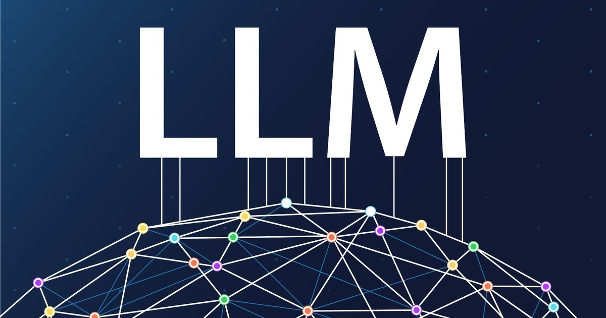

# Machine Learning Researcher
Area of interests: Machine Learning, Large Language Models, Natural language processing, Text Extraction, Computer Vision

<a href="#Education"><button style="background-color: #4CAF50; color: white; border: none; padding: 10px 20px; text-align: center; text-decoration: none; display: inline-block; font-size: 16px; margin: 4px 2px; cursor: pointer;">Education</button></a>
<a href="#Research Interests"><button style="background-color: #008CBA; color: white; border: none; padding: 10px 20px; text-align: center; text-decoration: none; display: inline-block; font-size: 16px; margin: 4px 2px; cursor: pointer;">Research Interests</button></a>
<a href="#Research Experience"><button style="background-color: #008CBA; color: white; border: none; padding: 10px 20px; text-align: center; text-decoration: none; display: inline-block; font-size: 16px; margin: 4px 2px; cursor: pointer;">Research Experience</button></a> 

### CV
[Download my CV](./Ibrahim_Al_Azher_CV.pdf)

### Blog
[Blog](https://ibrahimalazhar.blogspot.com/?fbclid=IwY2xjawILtoVleHRuA2FlbQIxMAABHe8JWUcf-bsCBz22QGv6VqJjdcIcmg0aN-1RfcsyI69INqsS6ejcjl-38Q_aem_gucpe6qykmU7xWLztMV4YQ) 

### Latest 
- Our work "LimTopic: LLM based Topic Modeling and Text Summarization for Analyzing Scientific Articles Limitations" accepted in 2024 ACM/IEEE Joint Conference on Digital Libraries (JCDL), 2024, Hong Kong.
- Our work "Limitation Generation of Research Papers with LLms and Retrieval Augmented Generation (RAG)" has been accepted in 11th
IEEE International Conference on Data Science and Advanced Analytics (DSAA 2024), San Diego, CA as a poster.
- Our work "Mitigating Visual Limitations of Research Papers" has been accepted in 2024 IEEE International Conference on Big Data (IEEE
BigData 2024) as a poster.

### Education
- PhD in Computer Science, Northern Illinois University, Dekalb, United States (August 2023 - Present)
- MS in Computer Science, Northern Illinois University, Dekalb, United States (August 2023 - Present)
- BSc in Computer Science, Sylhet Engineering College, Sylhet, Bangladesh (March 2016 - March 2021)

### Research Interests:
 
- Information Extraction (text and images) in Science of Science, utilizing Large Language Models (LLMs) and Retrieval Augmented Generation (RAG).
- Utilizing BERTopic, LLM with zero shot, few shots, chain/tree/graph of thoughts, self-consistency, prompt tuning, prefix tuning, fine-tuning with LoRa/QLora/Dora. 
- Jailbreaking, Evaluation, and Hallucination of LLM and Tiny LLm. 
- Optimizing LLM performance: time complexity 0(n) with Mamba (state space models), Flash Attention, KV cache, xLSTM, Deja Vu, Sparse LLM, Galore/Q-Galore, and scalable matrix multiplication.
- Open Source LLM: Llama, OLMO, Ollama, Dolma, Paloma.
- Vision: LLM (Llava), Diffusion model, CLIP, BLIP,GAN, Variational Autoencoder, Vision Transformer, Swithc Transformer, a Mixture of Experts, and multi-modal LLM.   

### Published
- I. A. Azher, S. Ahmed, M. S. Islam, and A. Khatun, ”Identifying Author in Bengali Literature by Bi‑LSTM with Attention Mechanism,”
2021 24th International Conference on Computer and Information Technology (ICCIT), Dhaka, Bangladesh, 2021,
pp. 1‑6, doi: 10.1109/ICCIT54785.2021.9689840. Description: Proposed a Bi‑LSTM model with a self‑attention mechanism by Glove embedding to identify the Author. Used Deep Learning models like CNN, RNN, LSTM, GRU, BiLSTM, and Fast text and showed proposed model outperforms.
- I. A. Azher, V. Reddy, A. P. Akella, H. Alhoori, "LimTopic: LLM-based Topic Modeling and Text Summarization for Analyzing Scientific Articles Limitations", 2024 ACM/IEEE Joint Conference on Digital Libraries (JCDL), 2024, Hong Kong. We extracted the scientific article’s limitations sections using a parsing tool. Here, each topic contains the title and ‘Topic Summary.’ This study focuses on effectively extracting and understanding these limitations through topic modeling and text summarization, utilizing the capabilities of LLMs. We extracted limitations from research articles and applied an LLM-based topic modeling integrated with the BERtopic approach to generate a title for each topic and ‘Topic Sentences.’ To enhance comprehension and accessibility, we employed LLM-based text summarization to create concise and generalizable summaries for each topic’s Topic Sentences and produce a ‘Topic Summary.’ Our
experimentation involved prompt engineering, fine-tuning LLM and BERTopic, and integrating BERTopic with LLM to generate topics, titles, and a summary.
- I. A. Azher, H. Alhoori, "Generating Suggestive Limitations from Research Articles Using LLM and Graph-Based Approach". 11th
IEEE International Conference on Data Science and Advanced Analytics (DSAA 2024). We are generating ‘Limitation’ based on other
section texts such as ‘Abstract,’ ‘Introduction,’ ‘Methodology,’ ‘Related Work,’ ‘Experiment’, and ’Conclusion.’ We experimented with various LLMs such as BART, T5, Pegasus, GPT 3.5, GPT 4, Gemini, and added Retrieval Augmented Generation
(RAG) with GPT 3.5 to generate the ‘limitation’ of research papers. We found that GPT 3.5 with RAG performs better than other models. We will extend our work by incorporating graph neural networks to generate limitations.
- I. A. Azher, H. Alhoori, "Mitigating Visual Limitations of Research Papers" has been accepted at 2024 IEEE International Conference on Big Data (IEEE
BigData 2024). In this work, we focus on visual-related limitations, which refer to issues like the clarity of charts, diagrams, unclear captions or descriptions, or methodological constraints in generating such visual and tabular data using multimodal LLM. 
  

  
### In Progress
<!-- - “Assessing the limitations sections in scientific article with LLM.”. Here, we extract the scientific article's limitations sections using a parsing tool. After extracting the limitation sections, we applied various LLMs for topic modeling GPT 3.5, GPT 4, Llama 2, and LLM for summarization.
 - “Generate open review from the scholarly article.” Take the text from a scientific article and generate the open review using LLM. 
- “Generate Limitations from the scholarly article.” Considering various sections and texts from scholarly articles and generating limitation sections using various LLMs and Retrieval Augmented Generation.
 - “Design a scientific paper architecture/flowcharts from texts with LLM.” Take images with captions from scientific articles and train a vision language multimodal LLM. Then, take the caption and generate the flowcharts or architecture of the research paper. -->
- “Scientific Image as a Limitation.” We are working on images of scientific articles and using algorithms like
superpixels or other stuff to improve the quality.
- “Can LLM predict citations ?” Take the scientific article abstract and other information and predict the
citations using LLM.
- “Software vulnerability detection with LLM.” Take the code from various sources and check whether the code is
vulnerable or not.
<!-- “Instagram image captioning”. Take the images from Instagram, generate the caption using a vision transformer, and check the original caption as a ground truth. -->

### Projects
- Medical datasets: MIMIC IV. Predicting mortality, hospital length of stay [MIMIC](https://github.com/IbrahimAlAzhar/Work-on-Medical-data-MIMIC-IV-)
 

- Amazon Review Analysis: Using data preprocessing, various machine learning
and deep learning models are applied to classify the customer review for the product. [ARA](https://github.com/IbrahimAlAzhar/Amazon_Review_Analysis_ML/)
- Image classification: Using CNN, Graph ConvNet, Inception Network, CNN, LeNet, AlexNet, GoogleNet, VGG16, and VGG19. [Image](https://github.com/IbrahimAlAzhar/MachineLearningWorks%7D%7Bhttps://github/Machine-Learning-works)
<!-- Classification on IMDB, MNIST, Iris dataset: Used several Machine learning models such as KNN, Naive Bayes, Linear Regression, Decision Tree, Ensemble Learning, and various deep learning models like CNN, RNN, GRU, -->
<!-- and BiLSTM classify. Online Newspaper: It is a web‑based project using Python, Django, and Javascript, and anyone can read news with a monthly subscription. Apply CNN, LeNet, AlexNet, GoogleNet, ResNet, VGG16, and -->
<!-- VGG19 models as well as transfer learning model on image data -->

### Experience
#### Research Assistant, Northern Illinois University, Dekalb, IL (May 2024 - Continue):
- Extracting texts and images from scientific articles using large language models. Incorporating LLM techniques
such as zero-shot, few-shot, chain of thoughts, self-consistency, and fine-tuning.
- LLM is used for code vulnerability detection and image analysis with large vision language models, superpixels, diffusion models, vision transformers, etc.

#### Teaching Assistant, Northern Illinois University, Dekalb, IL (Aug 2023 - May 2024)
- C++, Data Structures, and Algorithm Analysis
- Conducted weekly lab sessions for over 50 students, facilitating hands-on exercises in Data structures (BFS, DFS, Linked list) and Algorithms.

#### Software Engineer @Bysl Global Technology Group, Dhaka, Bangladesh (June 2021 ‑ February 2022)
 - Works on scalable projects from design to coding, testing, and installation using Python, XML, Javascript, PostgreSQL, and
jQuery in Linux OS. Designed and developed various ERP‑based business software and modules like sales, inventory,
purchase, website, and e‑commerce using Python language in Odoo

#### Junior Software Engineer, @Unisoft Systems Limited, Dhaka, Bangladesh (December 2020 ‑ May 2021)
- Research, assess, and lead the initiation of new technologies to maximize performance. Interact with clients, analyze
requirements, and develop an application in Python. I have written various SQL to generate numerous reports and created
various modules using the OOP Database model

### Skills: 
- Programming Languages: C, C++, Python, Javascript, Java, PHP
- Framework and Technologies: Django, Laravel, HTML, CSS, Bootstrap, Odoo, Django, Django REST 
- Open Source Library: Keras, Tensorflow, Pytorch, numpy, pandas, sci-kit learn, matplotlib,
- Database: Oracle SQL, MySql, Postgresql
- (Development tools): Git, Github, CodeBlocks, Pycharm, Visual Studio, Anaconda, Jupyter Notebook, Latex, Overleaf
- Operating system: Linux OS, Windows

### Honors & Awards
- Google GCP Grant Award, Google — Feb 2024-Feb 2025

### More Project
<!-- - Music store website (Python, Django, Javascript): Visitors who pay a fee can access, listen, share, and download the music on the website of a music store.[Music](https://github.com/IbrahimAlAzhar/MusicStoreWebsite) -->
- Exam marks management (PHP): A website project that allows teachers to enter the grades from various examinations and class quizzes,
which are then automatically converted with GPA. Students can only see their grades. [EMM](https://github.com/IbrahimAlAzhar/ExamMarksManagement)
- Newspaper (Python, Django): Developed a fully web-based project using Python, Django, and Javascript, allowing anyone to read the news with a monthly
subscription. Use a monthly payment subscription with Stripe.  [Newspaper](https://github.com/IbrahimAlAzhar/NewsPaper)
 
- MyShop: Sell and purchase items from a shop. Using HTML, CSS, Python, and Django. [MyShop](https://github.com/IbrahimAlAzhar/Myshop)
 

### Machine Learning:
- Experienced in Data Analysis, Linear Algebra, Probability, and Statistics behind Machine Learning Models (Linear Regression, Logistic, SVM, DT, SVM, NB). Also, Feature Importance, Dimensionality Reduction, Weight Initialization, Batch Normalization, Backpropagation, Activation functions (SGD, ADAM, NAG, Adagrad, Adadelta, RMSProp) 

### Programming
ACM Problem Solving: Over 350 problems were solved by various online judges. Over 200 problems from Codeforces,
100 problems from UVa Online Judge

### Conferences
 
 
 
 
 
