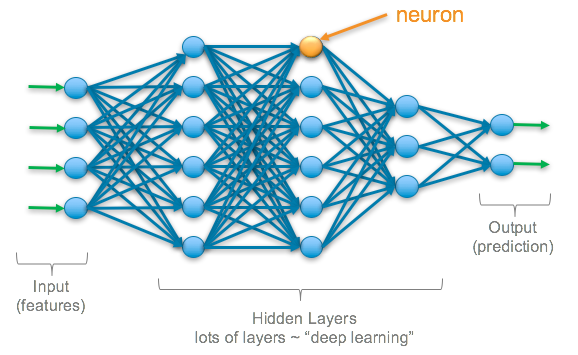
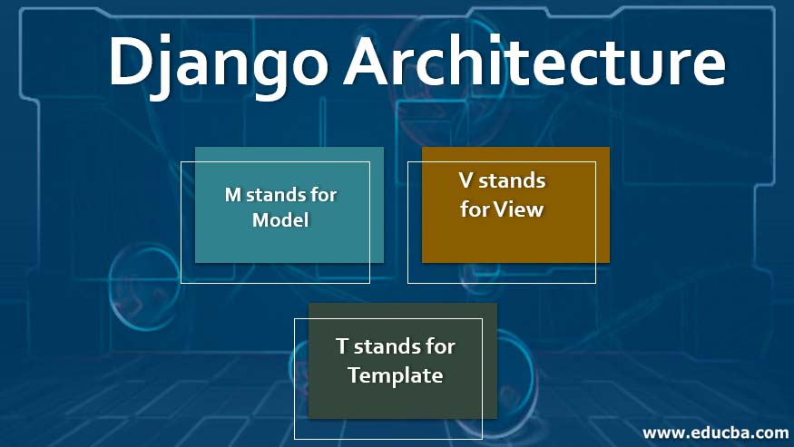
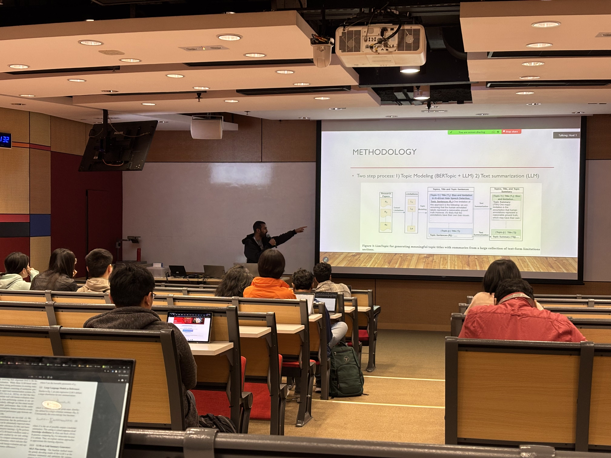
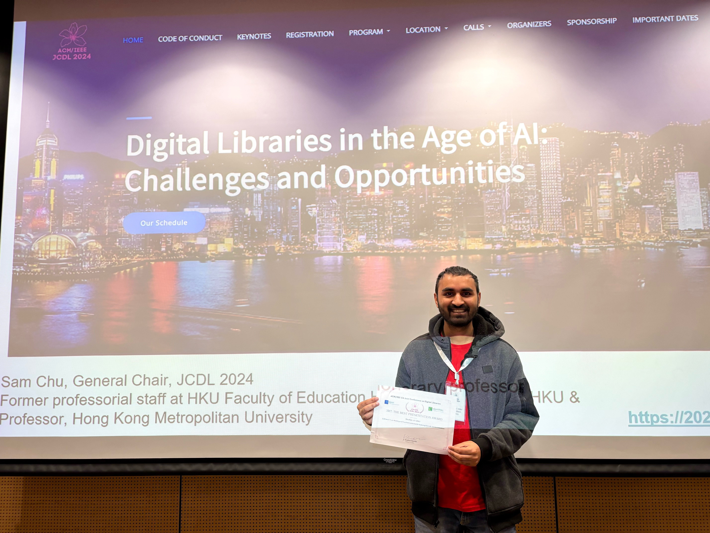
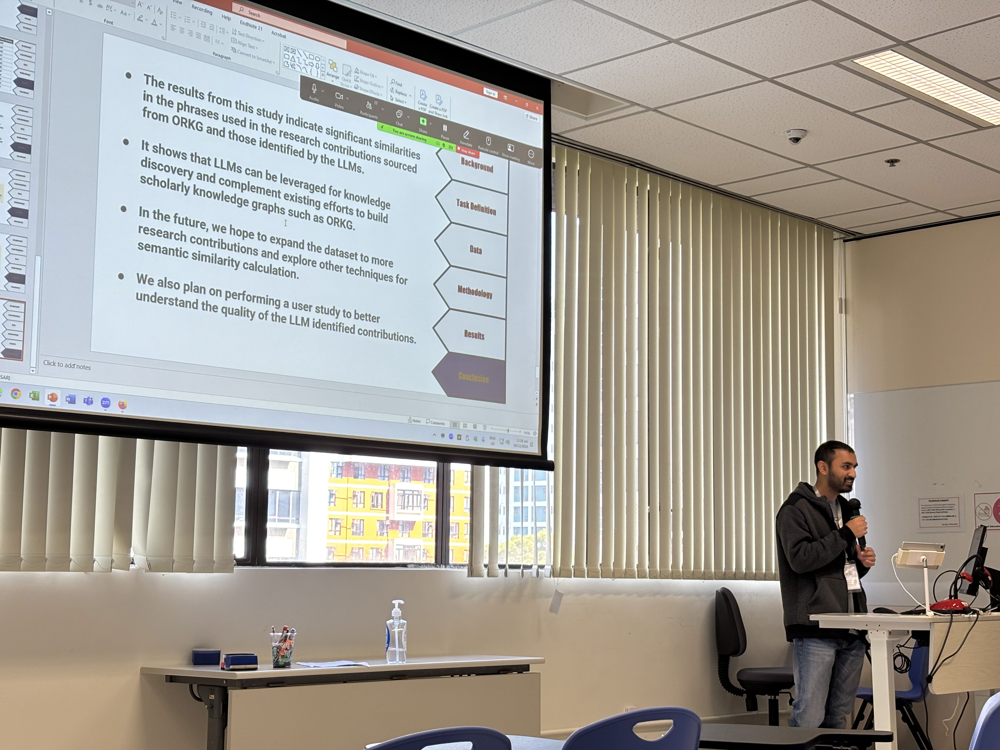
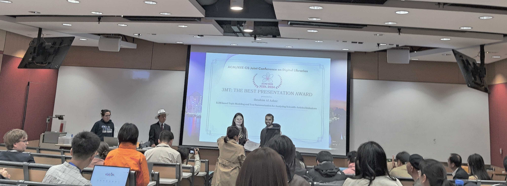

# PhD Student
Northern Illinois University, DeKalb, IL, USA
Research Assistant, DATALab
Area of interests: Machine Learning, Large Language Models, Natural language processing, Text Extraction, Computer Vision

Lab Website: [DATALab](https://datalab-niu.github.io/)

<a href="./Ibrahim_Al_Azher_CV__long___main_ (1).pdf"><button style="background-color: #4CAF50; color: white; border: none; padding: 10px 20px; text-align: center; text-decoration: none; display: inline-block; font-size: 16px; margin: 4px 2px; cursor: pointer;">Download CV</button></a>
<a href="https://www.linkedin.com/in/ibrahim-al-azhar-a68821158/"><button style="background-color: #008CBA; color: white; border: none; padding: 10px 20px; text-align: center; text-decoration: none; display: inline-block; font-size: 16px; margin: 4px 2px; cursor: pointer;">LinkedIn</button></a>
<a href="https://ibrahimalazhar.blogspot.com/"><button style="background-color: #008CBA; color: white; border: none; padding: 10px 20px; text-align: center; text-decoration: none; display: inline-block; font-size: 16px; margin: 4px 2px; cursor: pointer;">Blog</button></a>

### Latest 
- February 2026: Gave a talk about 'How to integrate Reinforcement Learning on LLM Agents' in NIU AI/ML seminar. 
- November 2025: Attended EMNLP 2025, Suzhou, China and Presented our work. The city is very nice. 
- Aug 2025: Our paper 'BAGELS: Benchmarking the Automated Generation and Extraction of Limitations from Scholarly Text' accepted on Conference on Empirical Methods in Natural Language Processing (EMNLP), 2025, China 
- Aug 2025: Our paper 'FutureGen: A RAG-based Approach to Generate the Future Work of Scientific Article' accetped on International Workshop on AI for Scientific Communication (Ai4SC 2025), IEEE eScience 2025, Chicago.
- June 2025: Attended and presented a Poster at the Midwest Machine Learning Symposium at the University of Chicago, Chicago. The topic is LLM Agents and RAG to generate limitations of a scientific article.
- May 2025: Attended and Presented a Poster at the Greater Chicago Workshop at Loyola University, Chicago. The topic is optimizing the database retrieval system in a scientific article. 
- April 2025: Gave a presentation on Evaluation in Retrieval Augmented Generation (RAG) system in NIU AI/ML Seminar
- April 2025: Attended and presented a Poster on Midwest Speech and Language Day (MSLD) 2025 at the University of Notre Dame, Indiana 
- March 2025: Successfully defended PhD Qualifying. 
- March 2025: Successfully defended Master's thesis
- February 2025: Gave a presentation on Large Language Models in the  NIU AI/ML Seminar 
- December 2024: Got the 3MT best paper presentation award in the 2024 ACM/IEEE Joint Conference on Digital Libraries (JCDL), 2024, Hong Kong, titled "Limitation Generation of Research Paper using LLM and RAG with Text Evaluation framework".
- October 2024: Our work "Mitigating Visual Limitations of Research Papers" has been accepted for the 2024 IEEE International Conference on Big Data (IEEE
BigData 2024) as a poster.
- September 2024: Our work "LimTopic: LLM-based Topic Modeling and Text Summarization for Analyzing Scientific Articles Limitations" was accepted in the 2024 ACM/IEEE Joint Conference on Digital Libraries (JCDL), 2024, Hong Kong.
- August 2024: Our work "Limitation Generation of Research Papers with LLMs and Retrieval Augmented Generation (RAG)" has been accepted in the 11th
IEEE International Conference on Data Science and Advanced Analytics (DSAA 2024), San Diego, CA, as a poster.

### Education
- PhD in Computer Science, Northern Illinois University, DeKalb, United States (August 2023 - Present)
- MS in Computer Science, Northern Illinois University, DeKalb, United States (August 2023 - May 2025)
- BSc in Computer Science, Sylhet Engineering College, Sylhet, Bangladesh (March 2016 - March 2021)

### Research Interests:
- Information Extraction (text and images) in Science of Science, utilizing Large Language Models (LLMs) and Retrieval Augmented Generation (RAG).
- Utilizing BERTopic, LLM with zero shot, few shots, chain/tree/graph of thoughts, self-consistency, prompt tuning, prefix tuning, fine-tuning with LoRa/QLora/Dora. 
- Jailbreaking, Evaluation, and Hallucination of LLM and Tiny LLM. 
- Optimizing LLM performance: time complexity 0(n) with Mamba (state space models), Flash Attention, KV cache, xLSTM, Deja Vu, Sparse LLM, Galore/Q-Galore, and scalable matrix multiplication.
- Open Source LLM: Llama, OLMO, Ollama, Dolma, Paloma.
- Vision: LLM (Llava), Diffusion model, CLIP, BLIP, GAN, Variational Autoencoder, Vision Transformer, Switch Transformer, a Mixture of Experts, and multi-modal LLM.   

### Published
I. A. Azher, M. J. Mokarrama, Z. Guo, S. R. Choudhury, H. Alhoori.
“BAGELS: Benchmarking the Automated Generation and Extraction of Limitations from Scholarly Text.”
The 2025 Conference on Empirical Methods in Natural Language Processing (EMNLP), 2025.
We proposed BAGELS, a benchmark dataset and framework for automated extraction and generation of limitations from scholarly texts. We framed a new evaluation metrics to evluate coverage of LLM generated limitations with ground truth.   [📄 PDF](https://arxiv.org/pdf/2505.18207) [📄 Dataset](https://huggingface.co/datasets/IbrahimAlAzhar/limitation-generation-dataset-bagels)

I. A. Azher, V. R. Seethi, A. P. Akella, H. Alhoori.
“LimTopic: LLM-based Topic Modeling and Text Summarization for Analyzing Scientific Articles’ Limitations.”
2024 ACM/IEEE Joint Conference on Digital Libraries (JCDL), December 2024, Hong Kong.
We extracted limitations from research articles and applied LLM-based topic modeling integrated with BERTopic to generate titles and topic sentences. LLM summarization produced concise and generalizable “Topic Summaries.” The method combines topic modeling, prompt engineering, and LLM fine-tuning for better comprehension of scientific limitations, which shows better performance than zero-shot LLM, fine-tuning LLM, or topic modeling alone.  [📄 PDF](https://dl.acm.org/doi/pdf/10.1145/3677389.3702605)

I. A. Azher, H. Alhoori.
“Generating Suggestive Limitations from Research Articles Using LLM and Graph-Based Approach.”
2024 ACM/IEEE Joint Conference on Digital Libraries (JCDL), December 2024, Hong Kong.
We proposed a graph-augmented LLM approach to generate limitations by integrating Retrieval-Augmented Generation (RAG) with citation and semantic graphs. This framework highlights context-aware limitations beyond simple extraction. 
 [📄 PDF](https://dl.acm.org/doi/pdf/10.1145/3677389.3702612)

I. A. Azher, M. J. Mokarrama, Z. Guo, S. R. Choudhury, H. Alhoori.
“FutureGen: A RAG-based Approach to Generate the Future Work of Scientific Articles.”
International Workshop on AI for Scientific Communication (Ai4SC), IEEE eScience 2025, Chicago.
We developed FutureGen, an LLM-based RAG framework with self-feedback for generating high-quality future work suggestions from research articles. [📄 PDF](https://arxiv.org/pdf/2503.16561)

I. A. Azher, H. Alhoori.
“Mitigating Visual Limitations of Research Papers.”
2024 IEEE International Conference on Big Data (IEEE BigData), December 2024, Washington D.C.
We focused on visual limitations in scholarly papers (charts, graphs, diagrams), using multimodal LLMs (Qwen, Llava, LLaMA, GPT-4) to generate clear descriptions. Evaluation employed LLM feedback and LLM-as-a-judge. 
[📄 PDF](https://www.researchgate.net/profile/Ibrahim-Al-Azher-2/publication/388099775_Mitigating_Visual_Limitations_of_Research_Papers/links/67ce9387e62c604a0dd6b368/Mitigating-Visual-Limitations-of-Research-Papers.pdf)

I. A. Azher, H. Alhoori.
“Generating Suggestive Limitations from Research Articles Using LLM and Graph-Based Approach.”
11th IEEE International Conference on Data Science and Advanced Analytics (DSAA), October 2024, San Diego, CA.
We built a knowledge graph from citations and semantic relations, then combined it with LLMs to recommend paper limitations, incorporating subgraphs into the generative process. 

I. A. Azher, S. Ahmed, M. S. Islam.
“Identifying Author in Bengali Literature by Bi-LSTM with Attention Mechanism.”
24th International Conference on Computer and Information Technology (ICCIT), December 2021.
Applied Bi-LSTM with attention to predict authorship in Bengali literature, achieving strong accuracy in literary style classification. [📄 PDF](https://www.researchgate.net/profile/Ibrahim-Al-Azher-2/publication/358209551_Identifying_Author_in_Bengali_Literature_by_Bi-LSTM_with_Attention_Mechanism/links/672da8e05852dd723caf600c/Identifying-Author-in-Bengali-Literature-by-Bi-LSTM-with-Attention-Mechanism.pdf)

T. Azad, I. A. Azher, S. R. Choudhury, H. Alhoori.
“Predicting Scholarly Impact with Retrieval-Augmented LLMs.”
Association of Computational Linguistics (ACL), Scholarly Document Processing (SDProc), 2025, Vienna, Austria.
Introduced a retrieval-augmented LLM pipeline for predicting scholarly impact, integrating metadata, citations, and content signals. [📄 PDF](https://aclanthology.org/2025.sdp-1.11.pdf)

M. Shahzad, J. Wilson, I. A. Azher, H. Alhoori, M. Rahimi.
“From Theory to Practice: Code Generation Using LLMs for CAPEC and CWE Frameworks.”
2nd International Workshop on Large Language Models for Code (LLM4Code), ICSE 2025.
We explored code generation with LLMs for security frameworks (CAPEC, CWE), bridging theoretical vulnerabilities with practical implementation. [📄 PDF](https://ieeexplore.ieee.org/abstract/document/11028365)

C. Muasher-Kerwin, M. C. Hughes, M. Foster, I. A. Azher, H. Alhoori.
“Exploring Large Language Models for Summarizing and Interpreting an Online Brain Tumor Support Forum.”
Sage Journal.
Investigated LLMs for summarizing and interpreting patient discourse in online medical forums, providing insights for healthcare support communities. [📄 PDF](https://journals.sagepub.com/doi/pdf/10.1177/20552076251337345)

M. S. R. Chowdhury, N. H. Khan, D. Singha, I. A. Azher, T. Ahmed, G. P. Shashi.
“Leveraging Self-Sovereign Identity (SSI) with Hyperledger Indy: A Decentralized Identity Ecosystem for Secure Document Management in Bangladesh.”
27th International Conference on Computer and Information Technology (ICCIT), December 2024, Cox’s Bazar, Bangladesh.
Proposed a decentralized SSI ecosystem using Hyperledger Indy for secure national-scale document management. [📄 PDF](https://ieeexplore.ieee.org/abstract/document/11021967)

H. Verma, M. J. Mokarrama, I. A. Azher, H. Alhoori.
“A Comparative Study of ORKG and LLM Identified Research Contributions.”
2nd Workshop on Innovation Measurement for Scientific Communication (IMSC), JCDL 2024, Hong Kong.
Compared ORKG vs LLM-based contribution identification, showing how LLMs can enhance structured research knowledge curation.

I. A. Azher.
“Limitations of Scientific Articles and Navigated Future Directions with LLM and RAG.”
Master’s Thesis, Northern Illinois University, May 2025.
Comprehensive thesis on automated limitation extraction and future work generation using topic modeling, RAG, and multi-agent LLM pipelines. [📄 PDF](https://www.proquest.com/docview/3219470393?pq-origsite=gscholar&fromopenview=true&sourcetype=Dissertations%20&%20Theses)

  
### In Progress
<!-- - “Assessing the limitations sections in scientific article with LLM.”. Here, we extract the scientific article's limitations sections using a parsing tool. After extracting the limitation sections, we applied various LLMs for topic modeling GPT 3.5, GPT 4, Llama 2, and LLM for summarization.
 - “Generate open review from the scholarly article.” Take the text from a scientific article and generate the open review using LLM. 
- “Generate Limitations from the scholarly article.” Considering various sections and texts from scholarly articles and generating limitation sections using various LLMs and Retrieval Augmented Generation.
 - “Design a scientific paper architecture/flowcharts from texts with LLM.” Take images with captions from scientific articles and train a vision language multimodal LLM. Then, take the caption and generate the flowcharts or architecture of the research paper. -->
- **I. A. Azher, B. Kedhaar, Z. Guo, S. R. Choudhury, H. Alhoori.**  
  *“LimAgents: Limitation Generation of Scientific Articles with LLM Agents and RAG”*.  
  Proposes multiple LLM agents (Extractor, Analyzer, Reviewer, Graph, Image, Self-feedback, and Master Agents) and a novel dual-RAG system that stores cited papers in a 1st-stage RAG database. Improves retrieval with an LLM re-ranker. [Preprint coming soon][📄 Dataset](https://huggingface.co/datasets/iaadlab/LimAgents_limitation_data_scientific_papers_with_cited_papers)

- **I. A. Azher, S. R. Choudhury, H. Alhoori.**  
  *“A Survey on Retrieval-Augmented Generation Evaluation Frameworks.”*  
  A comprehensive survey of **RAG evaluation methods**, covering metrics, datasets, and frameworks. [Draft in preparation]

- **I. A. Azher, S. R. Choudhury, H. Alhoori.**  
  *“A Survey on Scientific Article Idea Exploration and Novelty Measurement.”*  
  Investigates methods to evaluate novelty and creativity in scientific article ideas using LLMs. [Preprint coming soon]

- **T. Azad, I. A. Azher, S. R. Choudhury, H. Alhoori.**  
  *“Scientific Knowledge Transfer with LLMs: Recommending Methods Across Disciplines.”*  
  Explores **method recommendation across fields** by transferring scientific knowledge with LLMs. [Draft in progress]

- **T. Azad, I. A. Azher, H. Alhoori.**  
  *“How Large Language Models Affect Readability Scores in Scientific Articles.”*  
  Evaluates the impact of LLMs on **readability metrics** in academic writing. [Preprint coming soon]

- **I. A. Azher, H. Alhoori.**  
  *“Image Limitations in Scientific Articles.”*  
  Identifies and generates descriptions for **visual limitations** (charts, graphs, figures) in scientific articles. [Ongoing]

- **I. A. Azher, H. Alhoori.**  
  *“Trend Prediction of Scientific Articles with Time Series Analysis.”*  
  Applies **time series forecasting and LLMs** to predict emerging research trends. [Work in progress]

- **B. Kedhar, I. A. Azher, H. Alhoori.**  
  *“From Text to Scientific Article Flowchart/Diagram Generation.”*  
  Develops LLM-based methods for generating **flowcharts/diagrams** from text in research papers. [Preprint coming soon]
<!-- “Instagram image captioning”. Take the images from Instagram, generate the caption using a vision transformer, and check the original caption as a ground truth. -->

### Projects
- Medical datasets: MIMIC IV. Predicting mortality, hospital length of stay [MIMIC](https://github.com/IbrahimAlAzhar/Work-on-Medical-data-MIMIC-IV-)
<!--  -->

### Experience
#### Research Assistant, Northern Illinois University, Dekalb, IL (May 2024 - Continue):
- Extracting texts and images from scientific articles using large language models. Incorporating LLM techniques
such as zero-shot, few-shot, chain of thoughts, self-consistency, and fine-tuning.
- LLM is used for code vulnerability detection and image analysis with large vision language models, superpixels, diffusion models, vision transformers, etc.

#### Teaching Assistant, Northern Illinois University, Dekalb, IL (Aug 2023 - May 2024)
- C++, Data Structures, and Algorithm Analysis
- Conducted weekly lab sessions for over 50 students, facilitating hands-on exercises in Data structures (BFS, DFS, Linked list) and Algorithms.

#### Software Engineer @Bysl Global Technology Group, Dhaka, Bangladesh (June 2021 ‑ February 2022)
 - Works on scalable projects from design to coding, testing, and installation using Python, XML, Javascript, PostgreSQL, and
jQuery in Linux OS. Designed and developed various ERP‑based business software and modules like sales, inventory,
purchase, website, and e‑commerce using Python language in Odoo

#### Junior Software Engineer, @Unisoft Systems Limited, Dhaka, Bangladesh (December 2020 ‑ May 2021)
- Research, assess, and lead the initiation of new technologies to maximize performance. Interact with clients, analyze
requirements, and develop an application in Python. I have written various SQL to generate numerous reports and created
various modules using the OOP Database model

### Skills: 
- Programming Languages: C, C++, Python, Javascript, Java, PHP
- Framework and Technologies: Django, Laravel, HTML, CSS, Bootstrap, Odoo, Django, Django REST 
- Open Source Library: Keras, Tensorflow, Pytorch, numpy, pandas, sci-kit learn, matplotlib,
- Database: Oracle SQL, MySql, Postgresql
- (Development tools): Git, Github, CodeBlocks, Pycharm, Visual Studio, Anaconda, Jupyter Notebook, Latex, Overleaf
- Operating system: Linux OS, Windows

### Honors & Awards
- Google GCP Grant Award, Google — Feb 2024-Feb 2025

### More Project
<!-- - Music store website (Python, Django, Javascript): Visitors who pay a fee can access, listen, share, and download the music on the website of a music store.[Music](https://github.com/IbrahimAlAzhar/MusicStoreWebsite) -->
- Exam marks management (PHP): A website project that allows teachers to enter the grades from various examinations and class quizzes,
which are then automatically converted with GPA. Students can only see their grades. [EMM](https://github.com/IbrahimAlAzhar/ExamMarksManagement)
- Newspaper (Python, Django): Developed a fully web-based project using Python, Django, and Javascript, allowing anyone to read the news with a monthly
subscription. Use a monthly payment subscription with Stripe.  [Newspaper](https://github.com/IbrahimAlAzhar/NewsPaper)
 
- MyShop: Sell and purchase items from a shop. Using HTML, CSS, Python, and Django. [MyShop](https://github.com/IbrahimAlAzhar/Myshop)
 

### Machine Learning:
- Experienced in Data Analysis, Linear Algebra, Probability, and Statistics behind Machine Learning Models (Linear Regression, Logistic, SVM, DT, SVM, NB). Also, Feature Importance, Dimensionality Reduction, Weight Initialization, Batch Normalization, Backpropagation, Activation functions (SGD, ADAM, NAG, Adagrad, Adadelta, RMSProp) 

### Seminar
I am thrilled to get a chance to do a presentation in a seminar organized by the NIU CS department. I tried to give a brief overview of Large Language Models (LLMs), such as
1. Zero/few-shot learning, 2. Reasoning, Chain/Tree/Graph of thoughts, RLHF, RLAIF 3. Fine-tuning, Prompt tuning, 4. Flash Attention, 5. LLM as a Judge.
I also talked about the current limitations of LLM, how RAG (Retrieval Augmented Generation) overcomes those problems, and what types of issues still exist in RAG. For example, RAG retrieves noisy information, which may not align with the LLM generator.

full video on youtube: [YouTube](https://www.youtube.com/watch?v=XJ1rsZk6pps) 
seminar link:  [Seminar](https://www.niuai.org/)

2. Adversarial Attacks and Defense on LLM
3. How to integrated Reinforcement Learning on LLM Agents [Website](https://www.niuai.org/presentations/agents-rl/) 
<!--
### Conferences
 
 
 
 
 -->
